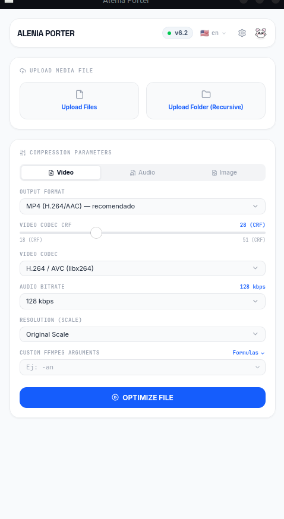
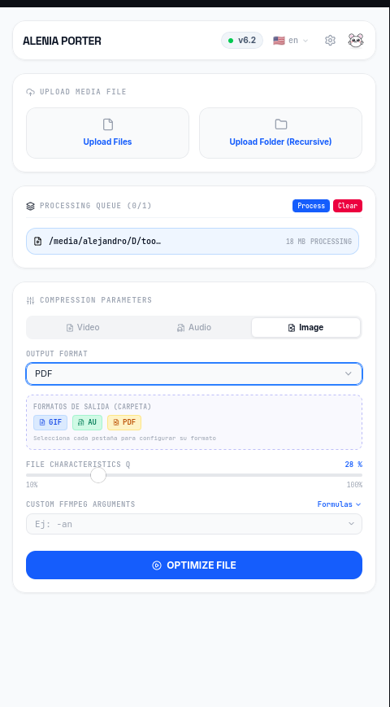
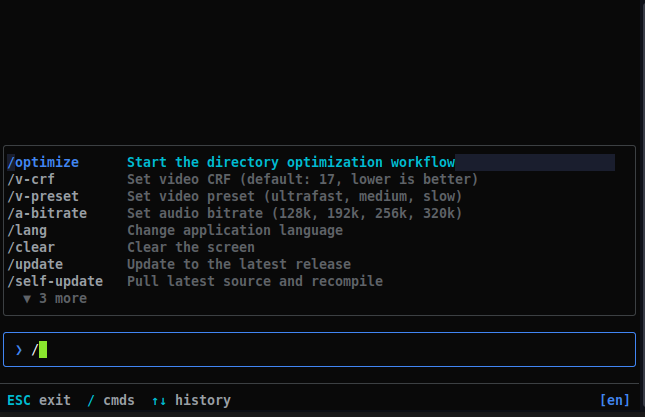
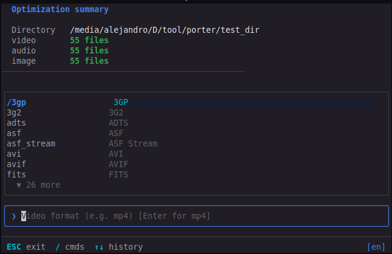
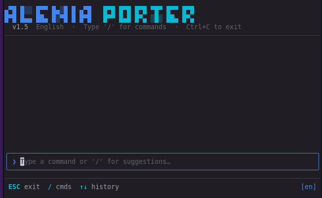

<div align="center">

# Alenia Porter v6.4

*High-performance universal media optimizer — images, video and audio in one tool.*

---

**Build & CI**
<br>
[](https://github.com/Kaia-Alenia/Alenia-Porter/actions/workflows/build.yml)
[](https://github.com/Kaia-Alenia/Alenia-Porter/actions/workflows/pages.yml)
[](https://github.com/Kaia-Alenia/Alenia-Porter/releases)
[](https://github.com/Kaia-Alenia/Alenia-Porter/releases)

**License & Stats**
<br>
[](https://www.gnu.org/licenses/gpl-3.0)
[](https://devglobe.app/developers/Kaia-Alenia)
[](https://gitgem.org/github/Kaia-Alenia/Alenia-Porter)

</div>

---

Alenia Porter is a professional, cross-platform, standalone tool that automates the optimization, compression, and preparation of media assets. It ships with embedded FFmpeg binaries — no external dependencies, no setup friction.

Originally designed for game engines (Ren'Py, Godot), it has evolved into a **general-purpose media optimizer** for musicians, video editors, web developers, and content creators.

---

## IDE Edition (Desktop GUI)

<div align="center">



*Main dashboard — folder selector, format picker, live progress bar*

</div>

<br>

<div align="center">

### Download IDE Edition

| [](https://github.com/Kaia-Alenia/Alenia-Porter/releases/latest) | [](https://github.com/Kaia-Alenia/Alenia-Porter/releases/latest) | [](https://github.com/Kaia-Alenia/Alenia-Porter/releases/latest) |
| :---: | :---: | :---: |
| [Download `.exe`](https://github.com/Kaia-Alenia/Alenia-Porter/releases/latest) | [Download `.dmg`](https://github.com/Kaia-Alenia/Alenia-Porter/releases/latest) | [Download `.AppImage`](https://github.com/Kaia-Alenia/Alenia-Porter/releases/latest) |
| Windows 10 / 11 | macOS 12 Monterey+ | Ubuntu 20.04+ / Arch |

</div>

<br>

**Quick Start:**

1. Run the **AleniaPorter** executable.
2. Set a custom nickname on first launch (links your local stats to telemetry anonymously).
3. Choose your preferred output format for audio (OGG or OPUS), video (WebM or MP4) and images (WebP or JPG).
4. Click **Select Folder** and pick the source directory.
5. Processed files are saved to an `Alenia_Optimized/` subfolder, preserving the original directory structure.

<div align="center">



*Format selection, quality sliders, and theme switcher*

</div>

---

## CLI Edition (Command Line)

<div align="center">



*Main TUI — command palette, history log, and language switcher*

</div>

<br>

<div align="center">



*`/optimize` flow — directory scan, format selection, and real-time progress*

</div>

<br>

<div align="center">



*Conversion summary — files processed, output paths, elapsed time*

</div>

<br>

The CLI is a self-contained **native Go binary** — no Python, no Node, no runtime required. Built for headless servers, CI/CD pipelines, and automation workflows.

<div align="center">

### Install CLI

| [-0078D6?style=for-the-badge&logo=powershell&logoColor=white)](#) | [-1f883d?style=for-the-badge&logo=gnubash&logoColor=white)](#) |
| :---: | :---: |
| Open **PowerShell as Administrator** and run: | Open a terminal and run: |
| `irm https://kaia-alenia.github.io/Alenia-Porter/install.ps1 \| iex` | `curl -fsSL https://kaia-alenia.github.io/Alenia-Porter/install.sh \| bash` |
| Adds `porter.exe` to `%LOCALAPPDATA%\Programs\AleniaPorterCLI` | Adds `porter` symlink to `~/.local/bin` |
| Requires Windows 10 1607+ | No external dependencies required |

</div>

<br>

Once installed, type `porter` in any terminal to open the interactive TUI.

**Non-interactive mode** (skips the TUI entirely, useful for scripts and CI):

```
porter version
porter optimize <directory> --vformat mp4 --aformat mp3 --iformat webp
```

**Inside the TUI**, commands use a `/` prefix. Type `/` to see autocomplete suggestions:

| Command | Description |
|---------|-------------|
| `/optimize` | Start a guided conversion — asks for folder, then formats step by step |
| `/help` | Show all commands and key bindings |
| `/formulas` | Show FFmpeg codec reference and common settings |
| `/lang [code]` | Switch language (`en`, `es`, `fr`, `ja`, `zh`, `ru`, `pt-br`, `de`, `pt`) |
| `/v-preset [value]` | Set video encoding preset (e.g. `slow`, `fast`, `ultrafast`) |
| `/v-crf [value]` | Set video CRF quality value (e.g. `17`, `23`, `28`) |
| `/a-bitrate [value]` | Set audio bitrate (e.g. `128k`, `192k`, `320k`) |
| `/clear` | Clear the session log |
| `/update` | Run the project update script |
| `/self-update` | Pull latest source and rebuild the binary |
| `/exit` | Exit the TUI |


---

## Supported Input Formats

All formats below are **automatically detected** by scanning source directories recursively.

### Audio

| Format | Extension | Notes |
|--------|-----------|-------|
| MP3 | `.mp3` | MPEG Layer 3 |
| WAV | `.wav` | Uncompressed PCM |
| FLAC | `.flac` | Lossless |
| AAC | `.aac` | Advanced Audio Coding |
| OGG Vorbis | `.ogg` | Open, lossy |
| Opus | `.opus` | Modern, ultra-efficient |
| M4A | `.m4a` | AAC in MPEG-4 container |
| WMA | `.wma` | Windows Media Audio |
| AIFF / AIF | `.aiff` `.aif` | Apple lossless raw |
| ALAC | `.alac` | Apple Lossless |
| AMR | `.amr` | Mobile voice codec |
| MIDI | `.mid` `.midi` | Sequenced music |
| MP2 | `.mp2` | Legacy MPEG Layer 2 |
| MPGA | `.mpga` | MPEG audio stream |
| AU / SND | `.au` `.snd` | Unix audio format |
| RA / RM | `.ra` `.rm` | RealAudio (legacy) |

### Video

| Format | Extension | Notes |
|--------|-----------|-------|
| MP4 | `.mp4` | H.264 / AAC |
| MKV | `.mkv` | Matroska container |
| WebM | `.webm` | VP9 / Opus |
| AVI | `.avi` | Legacy Microsoft container |
| MOV | `.mov` | Apple QuickTime |
| WMV | `.wmv` | Windows Media Video |
| FLV | `.flv` | Flash Video (legacy) |
| M4V | `.m4v` | Apple iTunes video |
| MPG / MPEG | `.mpg` `.mpeg` `.m2v` | MPEG-1/2 |
| 3GP / 3G2 | `.3gp` `.3g2` | Mobile video |
| TS / M2TS | `.ts` `.m2ts` | Transport Stream |
| VOB | `.vob` | DVD Video Object |
| OGV | `.ogv` | Ogg Theora |
| ASF | `.asf` | Advanced Systems Format |
| DivX | `.divx` | DivX encoded video |

### Images

| Format | Extension | Notes |
|--------|-----------|-------|
| PNG | `.png` | Lossless raster |
| JPEG | `.jpg` `.jpeg` | Lossy, universal |
| WebP | `.webp` | Modern lossy/lossless |
| BMP | `.bmp` | Uncompressed bitmap |
| TGA | `.tga` | Targa (game textures) |
| TIFF | `.tiff` | High-quality print |
| GIF | `.gif` | Animated / legacy |
| ICO | `.ico` | Windows icon |
| PDF | `.pdf` | Portable Document (read) |
| AVIF | `.avif` | AV1 Image Format |
| APNG | `.apng` | Animated PNG |

---

## Output Formats (Conversion Targets)

> **Stability:** `Stable` = dedicated code path | `Risky` = generic FFmpeg fallback, may produce empty/corrupt files | `Broken` = streaming protocol or format with no write support

### Audio Output

| Format | Extension | Codec | Stability |
|--------|-----------|-------|-----------|
| OGG Vorbis | `.ogg` | `libvorbis` | Stable |
| Opus | `.opus` | `libopus` | Stable |
| MP3 | `.mp3` | `libmp3lame` | Stable |
| FLAC | `.flac` | `flac` | Stable |
| WAV | `.wav` | `pcm_s16le` | Stable |
| AAC | `.aac` | `aac` | Stable |
| M4A | `.m4a` | `aac` | Stable |
| WMA | `.wma` | `wmav2` | Stable |
| ALAC | `.m4a` | `alac` | Stable |
| AIFF | `.aiff` | `pcm_s16be` | Stable |
| WavPack | `.wv` | `wavpack` | Stable |
| AU | `.au` | `pcm_s16be` | Stable |
| AMR | `.amr` | `amr_nb` (8kHz mono, forced) | Stable |
| AC3 | `.ac3` | `ac3` | Stable |
| DTS | `.dts` | `dca` | Stable |
| CAF | `.caf` | `pcm_s16le` | Stable |

### Video Output

| Format | Extension | Codec | Stability |
|--------|-----------|-------|-----------|
| MP4 | `.mp4` | `libx264` / NVENC / QSV / AMF | Stable |
| WebM | `.webm` | `libvpx-vp9` / vp9_nvenc | Stable |
| MKV | `.mkv` | `libx264` | Stable |
| AVI | `.avi` | `libx264` | Stable |
| MOV | `.mov` | `libx264` | Stable |
| M4V | `.m4v` | `libx264` | Stable |
| FLV | `.flv` | `libx264` | Stable |
| TS | `.ts` | `libx264` | Stable |
| 3GP / 3G2 | `.3gp` `.3g2` | `libx264` | Stable |
| WMV | `.wmv` | `wmv2` | Stable |
| MPEG / MPG / M2V | `.mpeg` `.mpg` `.m2v` | `mpeg2video` | Stable |
| OGV | `.ogv` | `libtheora` | Stable |
| GIF | `.gif` | `gif` encoder (15fps, max 640px) | Stable |
| VOB | `.vob` | Generic fallback — no encoder mapped | Risky |
| ASF | `.asf` | Generic fallback — no encoder mapped | Risky |
| RM / RealMedia | `.rm` | Generic fallback — no encoder mapped | Risky |
| AVIF (video) | `.avif` | Generic fallback — needs `libavif` build | Risky |
| MXF | `.mxf` | Generic fallback | Risky |
| NUT | `.nut` | Generic fallback (experimental container) | Risky |
| ADTS | `.adts` | Audio demuxer only — not a video container | Broken |
| ASF Stream | `.asf_stream` | Streaming protocol — cannot write to file | Broken |
| FITS | `.fits` | Astronomy image format — not a video container | Broken |
| RTP / MPEG-TS | `.rtp_mpegts` | Streaming protocol — cannot write to file | Broken |
| RTSP | `.rtsp` | Streaming protocol — cannot write to file | Broken |
| WebM Chunk | `.webm_chunk` | Streaming fragment — not a standalone file | Broken |
| WebM DASH Manifest | `.webm_dash_manifest` | Manifest metadata only | Broken |
| YUV4MPEG Pipe | `.yuv4mpegpipe` | Raw pipe format — not a file container | Broken |

### Image Output

| Format | Extension | Notes | Stability |
|--------|-----------|-------|-----------|
| WebP | `.webp` | `libwebp`, quality-controlled via `-q:v` | Stable |
| JPEG / JPG | `.jpg` `.jpeg` | Quality-mapped to FFmpeg `-q:v` scale | Stable |
| PNG | `.png` | Lossless | Stable |
| BMP | `.bmp` | Uncompressed | Stable |
| TIFF | `.tiff` | Archival quality | Stable |
| TGA | `.tga` | Game textures | Stable |
| ICO | `.ico` | Auto-scaled to max 256×256, `rgba` pixel format forced | Stable |
| PDF | `.pdf` | Via Pillow (not FFmpeg), converts to RGB first | Stable |
| GIF (from image) | `.gif` | FFmpeg applies 15fps + scale filter to a static image — produces a 1-frame GIF; may look corrupt in some viewers | Risky |
| AVIF | `.avif` | Falls to generic handler — needs `libavif` FFmpeg build | Risky |
| APNG | `.apng` | Falls to generic handler — animated PNG muxer unreliable in standard builds | Risky |
| MJPEG | `.mjpeg` | FFmpeg demuxer, not a standalone image output format | Broken |
| MPJPEG | `.mpjpeg` | Multipart JPEG stream — not a file format | Broken |
| SMJPEG | `.smjpeg` | Loki game format — no write support in FFmpeg | Broken |

---

## Pending / Known Issues

| Format | Context | Root Cause |
|--------|---------|------------|
| AVIF output | Image + Video | No dedicated handler — falls to generic FFmpeg; requires `libavif` compile-time flag |
| APNG output | Image | No dedicated handler — animated PNG muxer produces inconsistent results |
| GIF as image output | Image | Engine applies a video filter (15fps, 480px scale) to static images — 1-frame GIF is created, which may appear corrupt |
| MJPEG / MPJPEG / SMJPEG | Image output | These are demuxers or streaming formats, not file output containers — selecting them as a target will produce corrupt or empty files |
| VOB / ASF / RM output | Video | No explicit encoder assigned — falls to generic FFmpeg handler, result varies by source format |
| ADTS / RTSP / RTP / WebM Chunk / DASH Manifest / YUV4MPEG | Video | Streaming protocols or pipe formats — cannot be used as standalone file output targets |
| `.wv` input (folder mode) | IDE Edition | WavPack is in the GUI file-picker filter but **missing from `media_engine.py` audio extensions** — will not be detected when scanning a folder |
| HEIC / HEIF | Any | No FFmpeg encoder without a commercial codec build — not planned |
| MIDI as audio output | Audio | Sequenced format, not PCM audio — cannot be re-encoded |
| RA / RM as audio output | Audio | RealMedia codec not available in standard FFmpeg distributions |

---

## Architecture

| Component | Technology | Description |
|-----------|------------|-------------|
| **IDE Edition** | Python + Nuitka + pywebview | Standalone executable with embedded React UI |
| **Frontend UI** | React 19 + TypeScript + Vite | Rendered in a system WebView (no browser required) |
| **Media Engine** | Python + FFmpeg (embedded) | Concurrent processing via `ThreadPoolExecutor` |
| **CLI Edition** | Go 1.25.11 + Bubble Tea | Native TUI binary, zero dependencies |
| **CI/CD** | GitHub Actions | Builds + smoke tests on Windows, macOS, Linux |
| **GPU Acceleration** | NVENC / QSV / AMF (auto-detect) | Used for MP4 and WebM encoding when available |

---

## How It Works

1. **Efficient Scanning** — Recursively scans directories by extension, separating audio, video, and image files.
2. **Concurrent Processing** — Uses `ThreadPoolExecutor` with `(CPU count - 1)` workers. Each FFmpeg subprocess is forced to use a single thread to avoid contention on low-end hardware.
3. **Smart Deduplication** — A SHA-256 cache (`.alenia_cache.json`) skips already-converted files on subsequent runs.
4. **GPU Auto-detection** — Queries FFmpeg's encoder list at runtime and selects NVIDIA NVENC, Intel QSV, or AMD AMF when available, falling back to software encoders.
5. **Crash Resilience** — On FFmpeg failure, automatically retries in safe mode (software-only). Generates timestamped crash dumps for diagnostics.

---

## Telemetry and Privacy

Alenia Porter includes a lightweight, **fully opt-in**, asynchronous telemetry system.

- **No personal data is collected** — no filenames, no real names, no passwords, no disk contents.
- **What is sent:** anonymous UUID, chosen nickname, OS type, execution mode (GUI/CLI), output format extension (e.g. `webp`), file count, and elapsed time.
- **Purpose:** public benchmarks to measure performance across different platforms and hardware configurations.

---

## CLI vs IDE Edition

| Feature | IDE Edition (GUI) | CLI Edition |
|---------|-------------------|-------------|
| **Target Audience** | Content creators, video editors, designers | DevOps, backend devs, CI/CD automation |
| **Interface** | React UI with dynamic themes | Minimalist Bubble Tea TUI |
| **Architecture** | Python + pywebview + embedded FFmpeg | Native Go binary, zero dependencies |
| **Integration** | Standalone Desktop App | Shell scripts, GitHub Actions, Makefiles |
| **GPU Acceleration** | Auto (NVENC / QSV / AMF) | Auto (same FFmpeg backend) |
| **Batch Processing** | Folder-based with live progress | Directory or file list via flags |
| **Performance** | High | Ultra-high (minimal overhead) |

---

<div align="center">

**License:** GNU General Public License v3 (GPL v3).
*Designed to be free, transparent, and accessible to the developer and creator community.*

**Official Alenia Studios Email:** contact.aleniastudios@gmail.com

**Developed and translated by Kaia-Alenia Studios**
US &nbsp; ES &nbsp; FR &nbsp; JP &nbsp; CN &nbsp; RU &nbsp; BR &nbsp; DE

</div>
