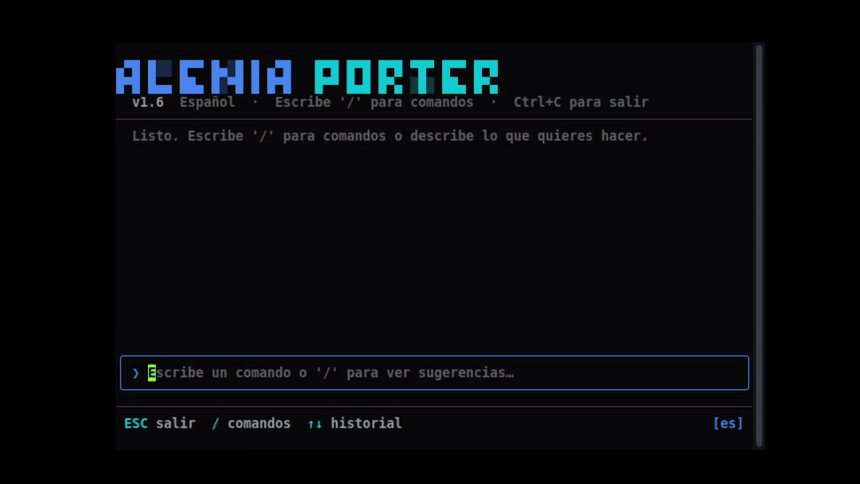

<div align="center">

# Alenia Porter v6.6

*Optimizador multimedia universal de alto rendimiento — imágenes, video y audio en una sola herramienta.*

---

**Construcción y CI**
<br>
[](https://github.com/Kaia-Alenia/Alenia-Porter/actions/workflows/build.yml)
[](https://github.com/Kaia-Alenia/Alenia-Porter/actions/workflows/pages.yml)
[](https://github.com/Kaia-Alenia/Alenia-Porter/releases)
[](https://github.com/Kaia-Alenia/Alenia-Porter/releases)

**Licencia y Estadísticas**
<br>
[](https://www.gnu.org/licenses/gpl-3.0)
[](https://devglobe.app/developers/Kaia-Alenia)
[](https://gitgem.org/github/Kaia-Alenia/Alenia-Porter)
</div>

---

Alenia Porter es una herramienta profesional, multiplataforma y autónoma que automatiza la optimización, compresión y preparación de recursos multimedia. Incluye binarios de FFmpeg integrados — sin dependencias externas, sin configuración previa.

Originalmente diseñado para motores de videojuegos (Ren'Py, Godot), ha evolucionado hacia un **optimizador multimedia de propósito general** para músicos, editores de video, desarrolladores web y creadores de contenido.

---

## Edición IDE (Interfaz Gráfica)

<div align="center">


*Panel principal — selector de carpeta, selector de formato, barra de progreso en tiempo real*

</div>

<br>

<div align="center">

### Descargar Edición IDE

| [](https://github.com/Kaia-Alenia/Alenia-Porter/releases/latest) | [](https://github.com/Kaia-Alenia/Alenia-Porter/releases/latest) | [](https://github.com/Kaia-Alenia/Alenia-Porter/releases/latest) |
| :---: | :---: | :---: |
| [Descargar `.exe`](https://github.com/Kaia-Alenia/Alenia-Porter/releases/latest) | [Descargar `.dmg`](https://github.com/Kaia-Alenia/Alenia-Porter/releases/latest) | [Descargar `.AppImage`](https://github.com/Kaia-Alenia/Alenia-Porter/releases/latest) |
| Windows 10 / 11 | macOS 12 Monterey+ | Ubuntu 20.04+ / Arch |

</div>

<br>

**Inicio rápido:**

1. Ejecuta el ejecutable **AleniaPorter**.
2. Configura un apodo personalizado en el primer inicio (vincula tus estadísticas locales de forma anónima).
3. Elige el formato de salida preferido para audio (OGG u OPUS), video (WebM o MP4) e imágenes (WebP o JPG).
4. Haz clic en **Select Folder** y selecciona el directorio de origen.
5. Los archivos procesados se guardan en una subcarpeta `Alenia_Optimized/`, respetando la estructura de directorios original.

<div align="center">


*Selección de formato, controles de calidad y selector de tema*

</div>

---

## Edición CLI (Línea de Comandos)

<div align="center">



*TUI principal — paleta de comandos, historial de sesión y selector de idioma*

</div>

<br>

<div align="center">


*Flujo `/optimize` — escaneo de directorio, selección de formato y progreso en tiempo real*

</div>

<br>

<div align="center">


*Resumen de conversión — archivos procesados, rutas de salida, tiempo transcurrido*

</div>

<br>

La CLI es un **binario nativo en Go** autocontenido — sin Python, sin Node, sin runtime. Diseñada para servidores headless, pipelines CI/CD y flujos de automatización.

<div align="center">

### Instalar CLI

| [-0078D6?style=for-the-badge&logo=powershell&logoColor=white)](#) | [-1f883d?style=for-the-badge&logo=gnubash&logoColor=white)](#) |
| :---: | :---: |
| Abre **PowerShell como Administrador** y ejecuta: | Abre una terminal y ejecuta: |
| `irm https://kaia-alenia.github.io/Alenia-Porter/install.ps1 \| iex` | `curl -fsSL https://kaia-alenia.github.io/Alenia-Porter/install.sh \| bash` |
| Instala `porter.exe` en `%LOCALAPPDATA%\Programs\AleniaPorterCLI` | Añade el symlink `porter` a `~/.local/bin` |
| Requiere Windows 10 1607+ | Requiere `git` y `go` instalados |

</div>

<br>

Una vez instalado, escribe `porter` en cualquier terminal para abrir la TUI interactiva.

**Modo no interactivo** (omite la TUI completamente, útil para scripts y CI):

```
porter version
porter optimize <directorio> --vformat mp4 --aformat mp3 --iformat webp
```

**Dentro de la TUI**, los comandos usan el prefijo `/`. Escribe `/` para ver sugerencias de autocompletado:

| Comando | Descripción |
|---------|-------------|
| `/optimize` | Inicia una conversión guiada — pregunta la carpeta y luego los formatos paso a paso |
| `/help` | Muestra todos los comandos y atajos de teclado |
| `/formulas` | Muestra la referencia de codecs FFmpeg y configuraciones comunes |
| `/lang [código]` | Cambia el idioma (`en`, `es`, `fr`, `ja`, `zh`, `ru`, `pt-br`, `de`, `pt`) |
| `/v-preset [valor]` | Establece el preset de codificación de video (ej. `slow`, `fast`, `ultrafast`) |
| `/v-crf [valor]` | Establece el valor CRF de calidad de video (ej. `17`, `23`, `28`) |
| `/a-bitrate [valor]` | Establece el bitrate de audio (ej. `128k`, `192k`, `320k`) |
| `/clear` | Limpia el historial de la sesión |
| `/update` | Ejecuta el script de actualización del proyecto |
| `/self-update` | Descarga el código fuente más reciente y recompila el binario |
| `/exit` | Cierra la TUI |


---

## Formatos de Entrada Soportados

Todos los formatos a continuación son **detectados automáticamente** al escanear directorios de origen de forma recursiva.

### Audio

| Formato | Extensión | Notas |
|---------|-----------|-------|
| MP3 | `.mp3` | MPEG Capa 3 |
| WAV | `.wav` | PCM sin comprimir |
| FLAC | `.flac` | Sin pérdida |
| AAC | `.aac` | Advanced Audio Coding |
| OGG Vorbis | `.ogg` | Abierto, con pérdida |
| Opus | `.opus` | Moderno, ultra-eficiente |
| M4A | `.m4a` | AAC en contenedor MPEG-4 |
| WMA | `.wma` | Windows Media Audio |
| AIFF / AIF | `.aiff` `.aif` | Audio sin procesar de Apple |
| ALAC | `.alac` | Apple Lossless |
| AMR | `.amr` | Codec de voz móvil |
| MIDI | `.mid` `.midi` | Música secuenciada |
| MP2 | `.mp2` | MPEG Capa 2 (legado) |
| MPGA | `.mpga` | Stream de audio MPEG |
| AU / SND | `.au` `.snd` | Formato de audio Unix |
| RA / RM | `.ra` `.rm` | RealAudio (legado) |

### Video

| Formato | Extensión | Notas |
|---------|-----------|-------|
| MP4 | `.mp4` | H.264 / AAC |
| MKV | `.mkv` | Contenedor Matroska |
| WebM | `.webm` | VP9 / Opus |
| AVI | `.avi` | Contenedor Microsoft (legado) |
| MOV | `.mov` | Apple QuickTime |
| WMV | `.wmv` | Windows Media Video |
| FLV | `.flv` | Flash Video (legado) |
| M4V | `.m4v` | Video Apple iTunes |
| MPG / MPEG | `.mpg` `.mpeg` `.m2v` | MPEG-1/2 |
| 3GP / 3G2 | `.3gp` `.3g2` | Video móvil |
| TS / M2TS | `.ts` `.m2ts` | Transport Stream |
| VOB | `.vob` | DVD Video Object |
| OGV | `.ogv` | Ogg Theora |
| ASF | `.asf` | Advanced Systems Format |
| DivX | `.divx` | Video codificado en DivX |

### Imágenes

| Formato | Extensión | Notas |
|---------|-----------|-------|
| PNG | `.png` | Raster sin pérdida |
| JPEG | `.jpg` `.jpeg` | Con pérdida, universal |
| WebP | `.webp` | Moderno, con/sin pérdida |
| BMP | `.bmp` | Mapa de bits sin comprimir |
| TGA | `.tga` | Targa (texturas de juegos) |
| TIFF | `.tiff` | Alta calidad para impresión |
| GIF | `.gif` | Animado / legado |
| ICO | `.ico` | Icono de Windows |
| PDF | `.pdf` | Documento portátil (lectura) |
| AVIF | `.avif## Formatos de Salida (Objetivos de Conversión)

> **Estabilidad:** `Estable` = ruta de código dedicada | `Inestable` = fallback genérico de FFmpeg, puede producir archivos vacíos o corruptos | `Roto` = protocolo de streaming o formato sin soporte de escritura

### Salida de Audio

| Formato | Extensión | Codec | Estabilidad |
|---------|-----------|-------|-------------|
| OGG Vorbis | `.ogg` | `libvorbis` | Estable |
| Opus | `.opus` | `libopus` | Estable |
| MP3 | `.mp3` | `libmp3lame` | Estable |
| FLAC | `.flac` | `flac` | Estable |
| WAV | `.wav` | `pcm_s16le` | Estable |
| AAC | `.aac` | `aac` | Estable |
| M4A | `.m4a` | `aac` | Estable |
| WMA | `.wma` | `wmav2` | Estable |
| ALAC | `.m4a` | `alac` | Estable |
| AIFF | `.aiff` | `pcm_s16be` | Estable |
| WavPack | `.wv` | `wavpack` | Estable |
| AU | `.au` | `pcm_s16be` | Estable |
| AMR | `.amr` | `amr_nb` (8kHz mono, forzado) | Estable |
| AC3 | `.ac3` | `ac3` | Estable |
| DTS | `.dts` | `dca` | Estable |
| CAF | `.caf` | `pcm_s16le` | Estable |

### Salida de Video

| Formato | Extensión | Codec | Estabilidad |
|---------|-----------|-------|-------------|
| MP4 | `.mp4` | `libx264` / NVENC / QSV / AMF | Estable |
| WebM | `.webm` | `libvpx-vp9` / vp9_nvenc | Estable |
| MKV | `.mkv` | `libx264` | Estable |
| AVI | `.avi` | `libx264` | Estable |
| MOV | `.mov` | `libx264` | Estable |
| M4V | `.m4v` | `libx264` | Estable |
| FLV | `.flv` | `libx264` | Estable |
| TS | `.ts` | `libx264` | Estable |
| 3GP / 3G2 | `.3gp` `.3g2` | `libx264` | Estable |
| WMV | `.wmv` | `wmv2` | Estable |
| MPEG / MPG / M2V | `.mpeg` `.mpg` `.m2v` | `mpeg2video` | Estable |
| OGV | `.ogv` | `libtheora` | Estable |
| GIF | `.gif` | encoder `gif` (15fps, máx 640px) | Estable |
| VOB | `.vob` | Fallback genérico — sin encoder asignado | Inestable |
| ASF | `.asf` | Fallback genérico — sin encoder asignado | Inestable |
| RM / RealMedia | `.rm` | Fallback genérico — sin encoder asignado | Inestable |
| AVIF (video) | `.avif` | Fallback genérico — requiere build con `libavif` | Inestable |
| MXF | `.mxf` | Fallback genérico | Inestable |
| NUT | `.nut` | Fallback genérico (contenedor experimental) | Inestable |
| ADTS | `.adts` | Solo demuxer de audio — no es un contenedor de video | Roto |
| ASF Stream | `.asf_stream` | Protocolo de streaming — no se puede escribir a archivo | Roto |
| FITS | `.fits` | Formato de imagen de astronomía — no es un contenedor de video | Roto |
| RTP / MPEG-TS | `.rtp_mpegts` | Protocolo de streaming — no se puede escribir a archivo | Roto |
| RTSP | `.rtsp` | Protocolo de streaming — no se puede escribir a archivo | Roto |
| WebM Chunk | `.webm_chunk` | Fragmento de streaming — no es un archivo independiente | Roto |
| WebM DASH Manifest | `.webm_dash_manifest` | Solo metadatos de manifiesto | Roto |
| YUV4MPEG Pipe | `.yuv4mpegpipe` | Formato de pipe sin procesar — no es un contenedor de archivo | Roto |

### Salida de Imágenes

| Formato | Extensión | Notas | Estabilidad |
|---------|-----------|-------|-------------|
| WebP | `.webp` | `libwebp`, calidad controlada vía `-q:v` | Estable |
| JPEG / JPG | `.jpg` `.jpeg` | Calidad mapeada a escala `-q:v` de FFmpeg | Estable |
| PNG | `.png` | Sin pérdida | Estable |
| BMP | `.bmp` | Sin comprimir | Estable |
| TIFF | `.tiff` | Calidad de archivo | Estable |
| TGA | `.tga` | Texturas de juegos | Estable |
| ICO | `.ico` | Auto-escalado a máx 256×256, pixel format `rgba` forzado | Estable |
| PDF | `.pdf` | Vía Pillow (no FFmpeg), convierte a RGB primero | Estable |
| GIF (desde imagen) | `.gif` | FFmpeg aplica filtro de 15fps + escala a imagen estática — produce un GIF de 1 frame; puede verse corrupto en algunos visores | Inestable |
| AVIF | `.avif` | Cae a handler genérico — requiere build FFmpeg con `libavif` | Inestable |
| APNG | `.apng` | Cae a handler genérico — muxer de PNG animado poco fiable en builds estándar | Inestable |
| MJPEG | `.mjpeg` | Demuxer de FFmpeg, no un formato de salida de imagen | Roto |
| MPJPEG | `.mpjpeg` | Stream JPEG multiparte — no es un formato de archivo | Roto |
| SMJPEG | `.smjpeg` | Formato de juego Loki — sin soporte de escritura en FFmpeg | Roto |

---

## Pendientes / Problemas Conocidos

| Formato | Contexto | Causa Raíz |
|---------|----------|------------|
| Salida AVIF | Imagen + Video | Sin handler dedicado — cae a FFmpeg genérico; requiere flag de compilación `libavif` |
| Salida APNG | Imagen | Sin handler dedicado — muxer de PNG animado produce resultados inconsistentes |
| GIF como salida de imagen | Imagen | El motor aplica un filtro de video (15fps, 480px) a imágenes estáticas — se crea un GIF de 1 frame que puede parecer corrupto |
| MJPEG / MPJPEG / SMJPEG | Salida de imagen | Son demuxers o formatos de streaming, no contenedores de archivo — seleccionarlos como destino produce archivos corruptos o vacíos |
| Salida VOB / ASF / RM | Video | Sin encoder explícito asignado — cae a handler genérico, resultado varía según el formato de origen |
| ADTS / RTSP / RTP / WebM Chunk / DASH Manifest / YUV4MPEG | Video | Protocolos de streaming o formatos pipe — no pueden usarse como destinos de archivo independientes |
| Entrada `.wv` (modo carpeta) | Edición IDE | WavPack está en el filtro del selector de archivos de la GUI pero **falta en las extensiones de audio de `media_engine.py`** — no será detectado al escanear una carpeta |
| HEIC / HEIF | Cualquiera | Sin encoder FFmpeg sin un codec comercial — no planeado |
| MIDI como salida de audio | Audio | Formato secuenciado, no PCM — no puede re-encodearse |
| RA / RM como salida de audio | Audio | Codec RealMedia no disponible en distribuciones estándar de FFmpeg |dear |
| Salida RA / RM | No soportado | Codec RealMedia no disponible en las distribuciones de FFmpeg |

---

## Arquitectura

| Componente | Tecnología | Descripción |
|------------|------------|-------------|
| **Edición IDE** | Python + Nuitka + pywebview | Ejecutable independiente con UI React integrada |
| **Frontend UI** | React 19 + TypeScript + Vite | Renderizado en WebView del sistema (sin navegador) |
| **Motor de Media** | Python + FFmpeg (integrado) | Procesamiento concurrente vía `ThreadPoolExecutor` |
| **Edición CLI** | Go 1.25.11 + Bubble Tea | Binario TUI nativo, cero dependencias |
| **CI/CD** | GitHub Actions | Builds + smoke tests en Windows, macOS, Linux |
| **Aceleración GPU** | NVENC / QSV / AMF (auto-detección) | Usado para codificación MP4 y WebM cuando está disponible |

---

## Cómo Funciona

1. **Escaneo Eficiente** — Escanea directorios recursivamente por extensión, separando archivos de audio, video e imagen.
2. **Procesamiento Concurrente** — Usa `ThreadPoolExecutor` con `(CPU count - 1)` workers. Cada subproceso FFmpeg se fuerza a usar un solo hilo para evitar contención en hardware de gama baja.
3. **Deduplicación Inteligente** — Una caché SHA-256 (`.alenia_cache.json`) omite archivos ya convertidos en ejecuciones posteriores.
4. **Auto-detección de GPU** — Consulta la lista de encoders de FFmpeg en tiempo de ejecución y selecciona NVIDIA NVENC, Intel QSV o AMD AMF cuando están disponibles, con fallback a encoders de software.
5. **Resiliencia ante Fallos** — Ante un fallo de FFmpeg, reintenta automáticamente en modo seguro (solo software). Genera volcados de crash con marca de tiempo para diagnóstico.

---

## Telemetría y Privacidad

Alenia Porter incluye un sistema de telemetría ligero, **totalmente anónimo** y asíncrono.

- **No se recopilan datos personales** — sin nombres de archivos, sin nombres reales, sin contraseñas, sin contenido del disco.
- **Qué se envía:** UUID anónimo, apodo elegido, tipo de SO, modo de ejecución (GUI/CLI), extensión del formato de salida (ej. `webp`), conteo de archivos y tiempo transcurrido.
- **Propósito:** benchmarks públicos para medir el rendimiento en distintas plataformas y configuraciones de hardware.

---

## CLI vs Edición IDE

| Característica | Edición IDE (GUI) | Edición CLI |
|----------------|-------------------|-------------|
| **Público Objetivo** | Creadores de contenido, editores, diseñadores | DevOps, devs backend, automatización CI/CD |
| **Interfaz** | UI React con temas dinámicos | TUI minimalista con Bubble Tea |
| **Arquitectura** | Python + pywebview + FFmpeg integrado | Binario Go nativo, cero dependencias |
| **Integración** | Aplicación de escritorio independiente | Scripts de shell, GitHub Actions, Makefiles |
| **Aceleración GPU** | Auto (NVENC / QSV / AMF) | Auto (mismo backend FFmpeg) |
| **Procesamiento por Lotes** | Por carpeta con progreso en vivo | Directorio o lista de archivos vía flags |
| **Rendimiento** | Alto | Ultra-alto (sobrecarga mínima) |

---

<div align="center">

**Licencia:** GNU General Public License v3 (GPL v3).
*Diseñado para ser libre, transparente y accesible para toda la comunidad de desarrolladores y creadores.*

**Correo Oficial de Alenia Studios:** contact.aleniastudios@gmail.com

**Desarrollado y traducido por Kaia-Alenia Studios**
US &nbsp; ES &nbsp; FR &nbsp; JP &nbsp; CN &nbsp; RU &nbsp; BR &nbsp; DE

</div>
